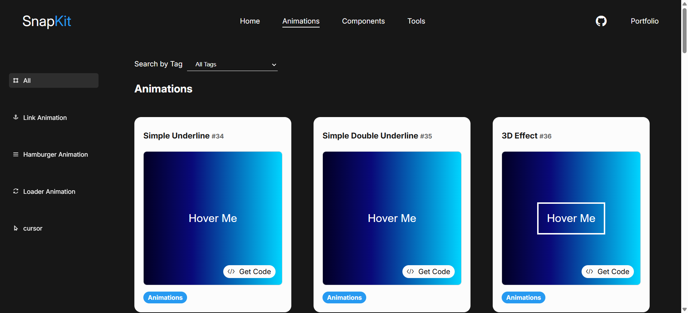
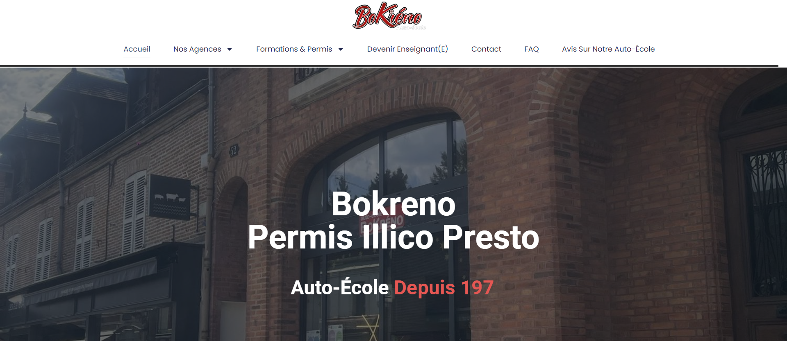
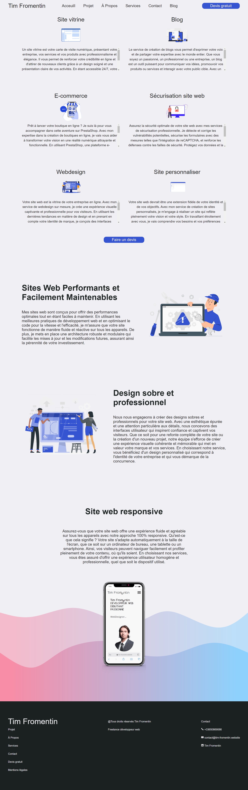



### Projet :

# Tables des matiéres
1.  [Présentation](#développeur-français-front-end)

2. [Compétence](#-compétence)
    - [Languages informatique](#-languages-informatique)
    - [Languages](#-languages)

3. [Listes projets](#️liste-projet)
    - [Site web complet](#-site-web-complet)
    - [Composants](#-composants)
    - [JavaScript](#-javascript)
        - [Chrome Extension](#-chrome-extension)
    - [Python](#-python)
    - [Exemple](#-exemple)
    - [Exercice front-end mentor](#️-exercice-front-end-mentor)
    - [Exercice l'école du web](#️-exercice-lécole-du-web)

4. [Contact](#-contact)

 
 

<h1 align="center">Développeur web full-stack junior</h1>

 

### 🈳 Languages 
- Français
- Anglais
- Espagnol

##  🗂️Liste projet

- [SnapKit une bibliothèque d'animations et de composants](https://snapkit.tim.fromentin.v70208.dev-campus.fr/#/)

- [Site web créé pour l'auto école Bokréno](https://autoecolebokreno.com/)

- [Site web créé pour l'entreprise S'CLIMAT](https://pompeachaleurloiret.fr/)

- [Site web dévelopement web freelance](https://github.com/Tim-Fromentin/tim-fromentin-website) : ceci est le site web où je propose mes services de développeur

- [Site web venant d'un exercice de frontendMentor sur le théme du tourisme spatiale](https://github.com/Tim-Fromentin/space-tourism-excercie-by-frontendmentor)

###  🧩 Composants

- [Pricing card](https://github.com/Tim-Fromentin/pricing-card-wave) : carte de prix

- [Animations de lien](https://github.com/Tim-Fromentin/link_animation) : Plusieurs animation de survol de lien en pur css

- [Loader animation](https://github.com/Tim-Fromentin/simple-loader-spin-css) : animation de chargement de page 

- [Plusieurs loader en pur css](https://github.com/Tim-Fromentin/free-loader-pure-css) : Plusieurs exemple de chargement de page uniquement en css

- [Landing page video](https://github.com/Tim-Fromentin/landing-page-video) : Écran d'accueil avec un fond vidéo 

- [Formulaire de contact](https://github.com/Tim-Fromentin/modern-form) : formulaire de contact simple avec plusieurs animations

- [Simple barre de navigation](https://github.com/Tim-Fromentin/simple-navbar) : une barre de navigation simple et responsive

- [Galerie d'image responsive](https://github.com/Tim-Fromentin/flex-gallery) : Galerie d'image responsive avec flexbox

### ｡🇯‌🇸‌ Javascript
- [Calculateur d'imc](https://github.com/Tim-Fromentin/calcul-imc-js) : calculateur d'imc en Javascript
#### 🌎 Chrome extension
- [Extension qui supprime le CSS d'une page](https://chromewebstore.google.com/detail/remove-all-css/ohjeefjccmpfakjehbdclamnhpipnhcj)
- [Extension pour tester de l'HTML et du CSS rapidement](https://chromewebstore.google.com/detail/codequick/jhagbagdnbanbiadpfdampfebfdacafn)
- [Extension pour cacher tout les inputs d'une page](https://chromewebstore.google.com/detail/privateye/gmbfklmpmcacbjokhdkfffnbgkdkocmi)
### 🐍 Python

- [Logiciel Tkinter](https://github.com/Tim-Fromentin/software_dev_utils_tkinter) : Outils pour les développeurs web.
    - Création d'un outil permettant de générer des mentions pour toutes les images et vidéos qui ne sont pas protégées par le droit d'auteur.
    - Générateur de connexion de base de données
    - Générateur de Qrcode
    - Compresseur d'images

- [Bot discord](https://github.com/Tim-Fromentin/bot-discord-help-developer) : Bot discord d'aide au développeur. Vous pouvez réduire votre code, voir des exemples de squelettes, analyser des sites Web et bien plus encore.

- [Description vente livre](https://github.com/Tim-Fromentin/description-vente-livre) : Script python pour simplifier une description de vente d'un livre.

### 💡 Exemple
- [Exemple squellete](https://github.com/Tim-Fromentin/Website-skeleton-file-with-database) : Exemple de squelette de projet front-end avec base de données

- [Exemple sémantique](https://github.com/Tim-Fromentin/Example-semantic-importance) : exemple de l'importance de la sémantique

### 🛠️ Exercice front-end mentor

- [recipe-page-main](https://github.com/Tim-Fromentin/recipe-page-main-exercice-by-frontendmentor)

- [social-links-profile-main](https://github.com/Tim-Fromentin/social-links-profile-main-exercice-by-frontendmentor)

- [blog-preview-card-main](https://github.com/Tim-Fromentin/blog-preview-card-main-exercice-by-frontendMentor)

- [product-preview-card-component-main](https://github.com/Tim-Fromentin/product-preview-card-component-main-exercice-by-frontendMentor)

- [product-preview-card-component-main](https://github.com/Tim-Fromentin/product-preview-card-component-main-exercice-by-frontendMentor)

- [results-summary-component-main](https://github.com/Tim-Fromentin/results-summary-component-main-exercice-by-FrontendMentor)

- [qr-code-component-main](https://github.com/Tim-Fromentin/qr-code-component-main-exercice-by-FrontendMentor)

- [3-column-preview-card-component-main](https://github.com/Tim-Fromentin/3-column-preview-card-component-main-exercice-by-frontendMentor)

- [stats-preview-card-component-main](https://github.com/Tim-Fromentin/stats-preview-card-component-main-excercice-by-frontendMentor)

- [faq-accordion-main](https://github.com/Tim-Fromentin/faq-accordion-main-exercice-by-FrontendMentor)

- [profile-card-component-main](https://github.com/Tim-Fromentin/profile-card-component-main-exercice-by-FrontendMentor)

- [huddle-landing-page-with-single-introductory](https://github.com/Tim-Fromentin/huddle-landing-page-with-single-introductory-section-master-exercice-by-FrontendMentor)

    ### 📩 Contact
  - [email](tim.fromentin.dev.pro@gmail.com)

