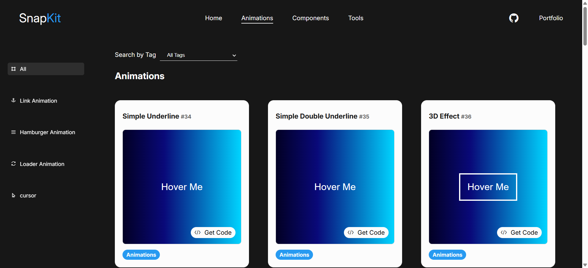
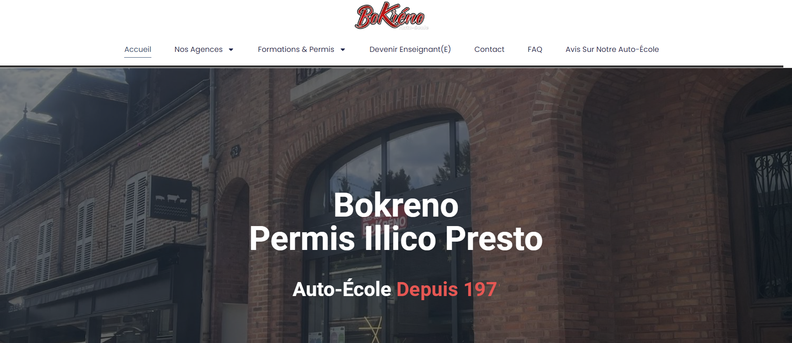

### Projet :

# Tables des matiéres
1.  [Présentation](#développeur-français-front-end)

2. [Compétence](#-compétence)
    - [Languages informatique](#-languages-informatique)
    - [Languages](#-languages)

3. [Listes projets](#️liste-projet)
    - [Site web complet](#-site-web-complet)
    - [Composants](#-composants)
    - [JavaScript](#-javascript)
        - [Chrome Extension](#-chrome-extension)
    - [Python](#-python)
    - [Exemple](#-exemple)
    - [Exercice front-end mentor](#️-exercice-front-end-mentor)
    - [Exercice l'école du web](#️-exercice-lécole-du-web)

4. [Contact](#-contact)

 
 

<h1 align="center">Développeur web full-stack junior</h1>

 

### 🈳 Languages 
- Français
- Anglais
- Espagnol

##  🗂️Liste projet

- [SnapKit une bibliothèque d'animations et de composants](https://snapkit.tim.fromentin.v70208.dev-campus.fr/#/)

- [Site web créé pour l'auto école Bokréno](https://autoecolebokreno.com/)

- [Site web créé pour l'entreprise S'CLIMAT](https://pompeachaleurloiret.fr/)

    ### 📩 Contact
  - [email](tim.fromentin.dev.pro@gmail.com)

